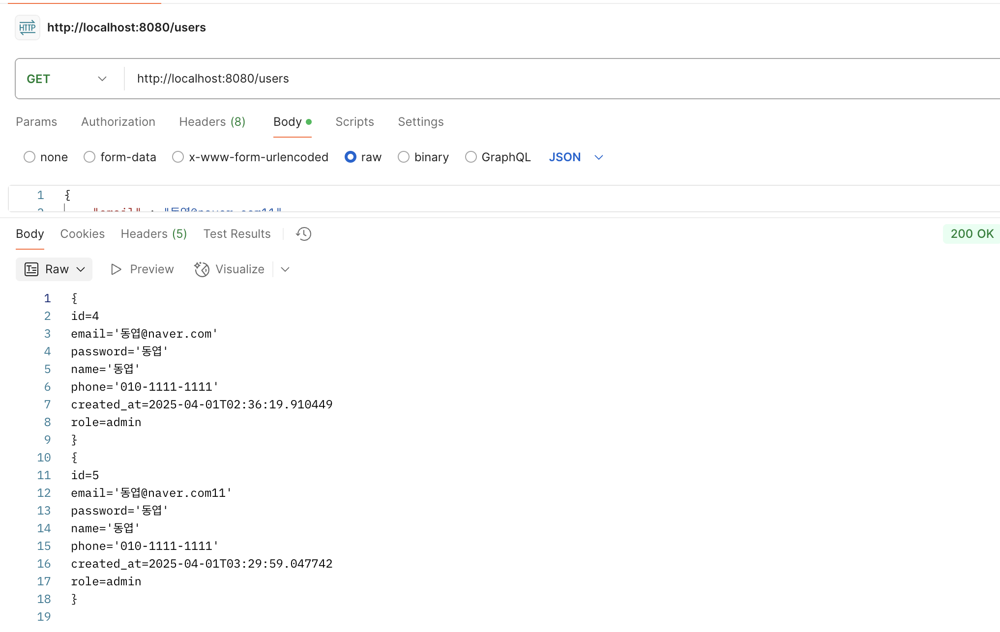
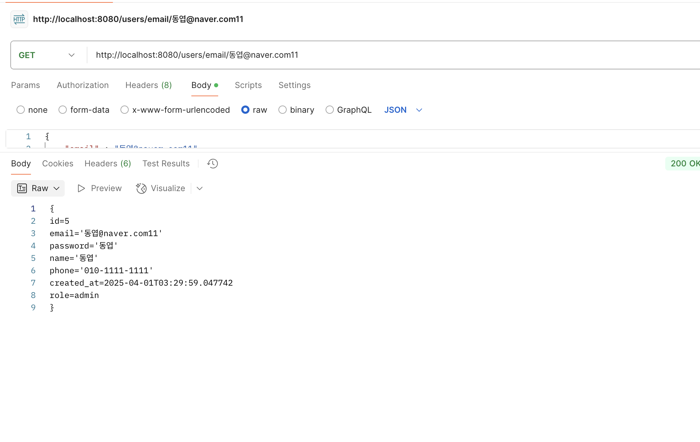
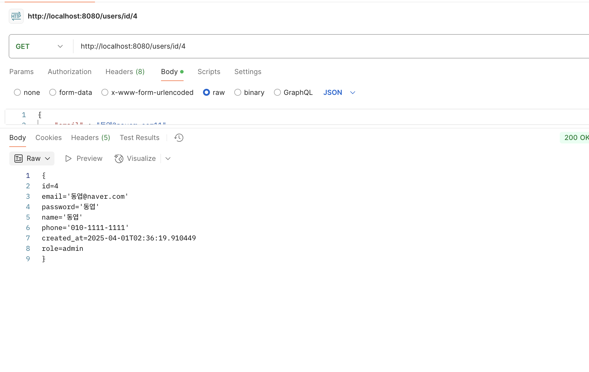
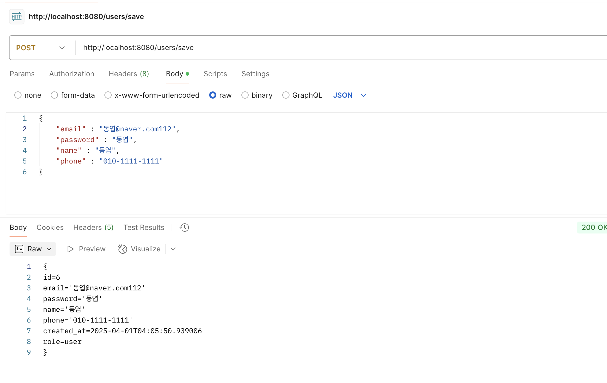
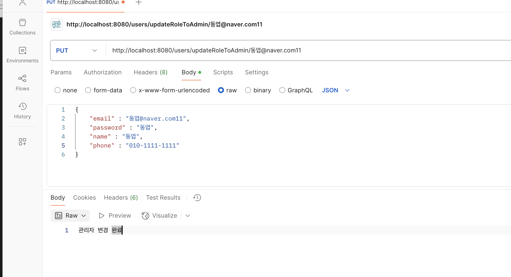
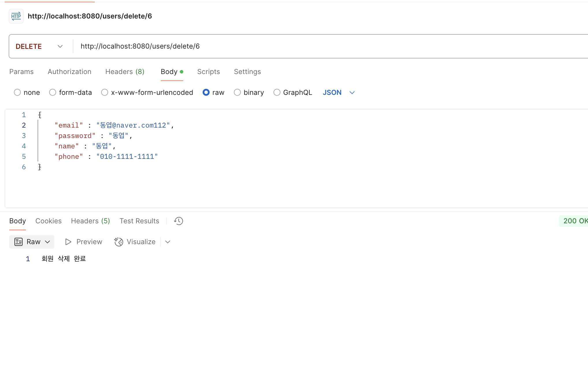

# 회원관리

### API
    GET
    모든 회원 조회 -> http://localhost:8080/users
    특정 회원 조회(id) -> http://localhost:8080/users/id/{id}
    특정 회원 조회(email) -> http://localhost:8080/users/email/{email}

    POST
    회원 생성 -> http://localhost:8080/users/save

    DELETE
    회원 삭제 -> http://localhost:8080/users/delete/{id}

    PUT
    관리자 변경(email) -> http://localhost:8080/users/updateRoleToAdmin/{email}

### 구현 중 고민 했던 것 및 추가 사항
    1. 특정 회원을 조회할 때 이메일로 조회하지 않을까 싶은 마음(우린 id대신 email 이기에)
    2. 관리자 변경 할때 DB로 하는 것 보단 Role를 admin으로 자동 변경해주는 엔드포인트를 만들면 편리하지 않을까 싶은 마음으로 생성
    3. Users 테이블에 Role이 admin으로 변경시에 Admin 테이블로 user_id,email,password,phone 자동 추가
    4. Stream 형식으로 제작을 해도 되는지 (그래서 반반 섞어봄, 다들 점검 후 리팩토링 예정)
    5. \n도 상수화를 시켜야하는지 , entity에 json 값 출력 toString도 상수화를 해야할지

### API 테스트 성공 이미지

### 모든 회원 조회

### 이메일로 조회

### 아이디로 조회

### 회원 생성

### 관리자 변경

### 유저 삭제

